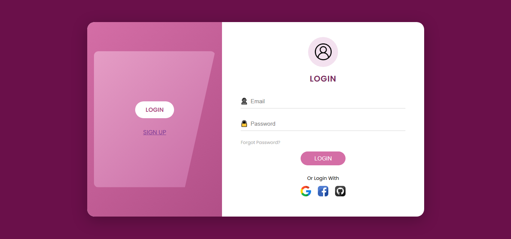
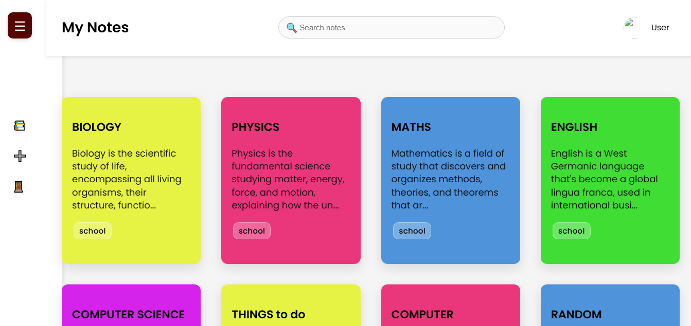

# 📝 Student Notes App

A simple and user-friendly notes management application built using **Node.js**, **Express**, **MongoDB**, and **EJS**.  
This app lets users create, edit, delete, and organize their notes with tags — along with login & registration functionality.

---

## 🚀 Features

- ✏️ Create, edit, and delete notes  
- 🔐 User authentication (Register & Login)  
- 🏷️ Add tags to notes  
- 🔎 Search notes by title/content  
- 🎨 Clean and responsive UI  
- 📂 Organized MVC folder structure  

---

## 🛠️ Tech Stack

- **Backend:** Node.js, Express  
- **Frontend:** EJS templates, CSS  
- **Database:** MongoDB + Mongoose  
- **Other:** Middleware, Routing architecture  

---

## 📁 Folder Structure

student-notes-app/
│
├── views/              # EJS templates (UI pages)
├── public/             # CSS files
├── models/             # Mongoose models
├── middleware/         # Authentication middleware
├── routes/             # App routes
├── server.js           # Entry point
├── package.json
├── package-lock.json
├── .gitignore
├── .env.example        # Environment variable template
└── README.md

---

## ⚙️ Installation & Setup

### 1. Clone the repository
git clone https://github.com/Saniya28209
student-notes-app.git

### 2. Go into the project folder
cd student-notes-app

### 3. Install dependencies
npm install

### 4. Create a `.env` file  
Use this format:
MONGO_URL=
PORT=3000

### 5. Start the server
npm start

App will run on:  
http://localhost:3000/

---

## 📦 Environment Variables

This project requires the following environment variables  
(**lol I ain't stupid , work with your own credentials 😭**):

MONGO_URL=
PORT=

---

## 📸 Screenshots

 

  

  

---

## 🙋‍♀️ About the Developer

Developed by **Saniya** —  
Hi there GitHub! Just a normal average BCA student trying her level best to improve herself and *not* pull her hair out from all the errors 😭.

My interests are in the field of:  
1. Data analytics (interest only… haven't started working on it yet lol!)  
2. Back-end development  
3. Living a drama-free life (but if you have tea, give me some too 👀☕)  

---

## ⭐ Future Improvements

- Add dark mode  
- Add password reset  
- Add note sharing  
- Add profile section  

---

## 🎉 Thank You!

If you like this project, feel free to ⭐ star the repository on GitHub!  
And if you have tips, advice, or project ideas, I would love to hear them.  
If I seem tolerable enough, we can collaborate too 😄  

***Toodles!***

